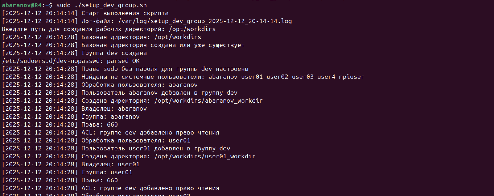
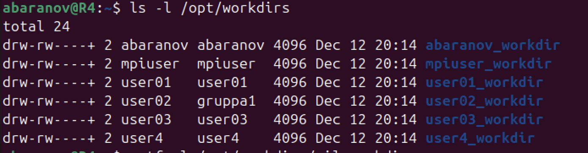
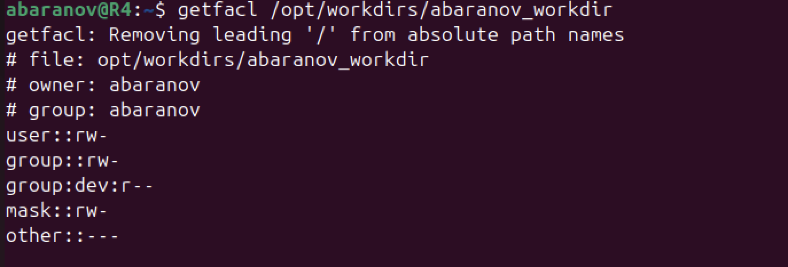
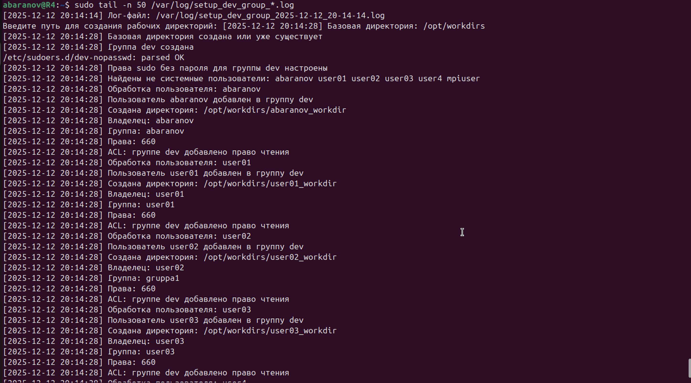

# Bash Dev Group Setup

## Описание

Bash-скрипт `setup_dev_group.sh` выполняет задание:

- создает группу `dev`;
- добавляет в нее всех не системных пользователей;
- выдает группе `dev` sudo без пароля;
- создает рабочие директории вида `<user_name>_workdir`;
- путь к директориям принимает через ключ `-d`;
- если ключ `-d` не указан — спрашивает путь при запуске;
- ставит права `660`;
- назначает владельца и группу;
- добавляет группе `dev` право чтения через ACL;
- пишет лог в консоль и файл.

---

## Структура проекта

```text
.
├── README.md
├── setup_dev_group.sh
└── screenshots
    ├── 01_run_script.png
    ├── 02_dev_group.png
    ├── 03_workdirs.png
    ├── 04_acl.png
    ├── 05_sudo_check.png
    └── 06_logs.png
```

---

## Запуск

```bash
chmod +x setup_dev_group.sh
sudo ./setup_dev_group.sh -d /opt/workdirs
```

---

## Скриншоты выполнения

### 1. Запуск скрипта

На скриншоте показан запуск скрипта.

```bash
sudo ./setup_dev_group.sh -d /opt/workdirs
```



---

### 2. Проверка группы `dev`

Команда показывает, что группа `dev` создана, а не системные пользователи добавлены в нее.

```bash
getent group dev
```


---

### 3. Проверка рабочих директорий

Команда показывает созданные директории пользователей.

Видно, что директории имеют формат:

```text
<user_name>_workdir
```

Также видно владельца, группу и права доступа `660`.

```bash
ls -l /opt/workdirs
```



---

### 4. Проверка ACL-доступа для группы `dev`

Команда показывает ACL-права для директории пользователя.

Строка `group:dev:r--` подтверждает, что группе `dev` выдан доступ на чтение.

```bash
getfacl /opt/workdirs/user1_workdir
```



---

### 5. Проверка sudo без пароля

Команда проверяет, что пользователь из группы `dev` может выполнять `sudo` без ввода пароля.

```bash
sudo -n whoami
```

Ожидаемый результат:

```text
root
```


---

### 6. Проверка логирования

Скрипт пишет лог одновременно в терминал и в файл.

Команда показывает последние строки лог-файла:

```bash
sudo tail -n 50 /var/log/setup_dev_group_*.log
```



---

## Итог

Все требования задания выполнены:

- группа `dev` создана;
- пользователи добавлены в группу `dev`;
- sudo без пароля настроен;
- рабочие директории созданы;
- права `660` выставлены;
- ACL для группы `dev` добавлен;
- логирование работает.
