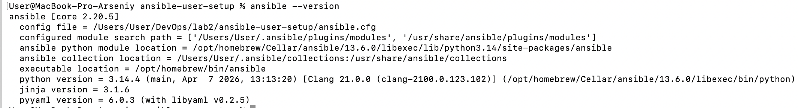
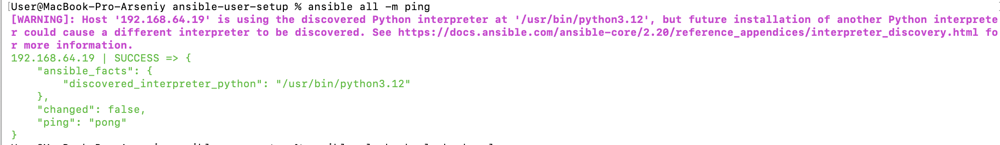
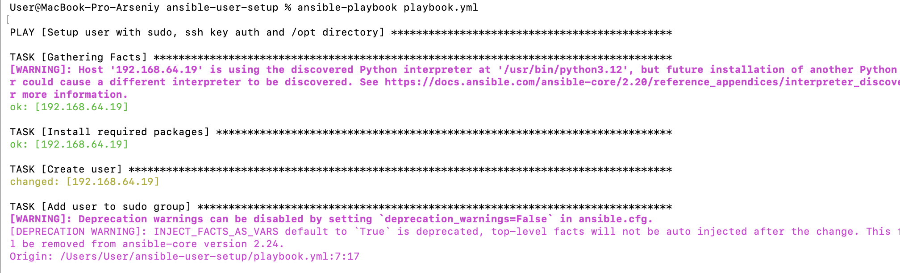
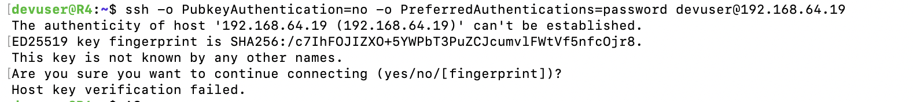

# Ansible User Setup

## Описание

В данной лабораторной работе используется Ansible playbook `playbook.yml`, который настраивает удаленную Linux-машину.

Playbook выполняет следующие действия:

- создает пользователя `devuser`;
- выдает пользователю права `sudo`;
- настраивает SSH-авторизацию по ключу;
- отключает SSH-авторизацию по паролю;
- создает директорию `/opt/devuser_workdir`;
- назначает владельцем директории пользователя `devuser`;
- устанавливает права на директорию `660`.

---

## Структура проекта

```text
.
├── README.md
├── ansible.cfg
├── inventory.ini
├── playbook.yml
├── files
│   └── devuser_key.pub
└── screenshots
    ├── 01_ansible_version.png
    ├── 02_ansible_ping.png
    ├── 03_playbook_run.png
    ├── 04_user_created.png
    ├── 05_sudo_check.png
    ├── 06_ssh_key_auth.png
    ├── 07_password_auth_disabled.png
    └── 08_opt_directory.png
```

---

## Запуск

Перед запуском был установлен Ansible на управляющей машине.

```bash
ansible --version
```

Затем была проверена доступность удаленной машины:

```bash
ansible all -m ping
```

После этого был запущен playbook:

```bash
ansible-playbook playbook.yml
```

---

## Скриншоты выполнения

### 1. Проверка установки Ansible

Команда показывает, что Ansible установлен на управляющей машине и готов к работе.

```bash
ansible --version
```



---

### 2. Проверка подключения к удаленной машине

Команда проверяет, что Ansible может подключиться к удаленной машине по SSH.

```bash
ansible all -m ping
```

Ожидаемый результат — `SUCCESS` и ответ `pong`.



---

### 3. Запуск playbook

На скриншоте показан запуск Ansible playbook.

```bash
ansible-playbook playbook.yml
```

Playbook выполняет настройку удаленной машины: создает пользователя, выдает sudo-права, добавляет SSH-ключ, отключает вход по паролю и создает директорию в `/opt/`.



---

### 4. Проверка создания пользователя

Команда показывает, что пользователь `devuser` был создан на удаленной машине.

```bash
id devuser
```


---

### 5. Проверка sudo-прав

Команда проверяет, что пользователь `devuser` может выполнять команды через `sudo` без запроса пароля.

```bash
sudo -n whoami
```

Ожидаемый результат:

```text
root
```


---

### 6. Проверка SSH-авторизации по ключу

На скриншоте показано подключение к удаленной машине под пользователем `devuser` с использованием SSH-ключа.

```bash
ssh -i files/devuser_key devuser@192.168.64.19
```

Если подключение выполнено без ввода пароля, значит авторизация по SSH-ключу настроена успешно.


---

### 7. Проверка отключения SSH-авторизации по паролю

Команда пытается подключиться к удаленной машине без использования ключа, только по паролю.

```bash
ssh -o PubkeyAuthentication=no -o PreferredAuthentications=password devuser@192.168.56.10
```

Подключение не должно выполниться, так как парольная авторизация по SSH отключена.



---

### 8. Проверка директории в `/opt/`

Команда показывает, что директория `/opt/devuser_workdir` создана.

```bash
ls -ld /opt/devuser_workdir
```

Ожидаемый результат:

```text
drw-rw---- 2 devuser devuser 4096 May  4 12:00 /opt/devuser_workdir
```

На скриншоте видно:

- директория создана в `/opt/`;
- владелец — `devuser`;
- группа — `devuser`;
- права — `660`.


---

## Итог

Все требования лабораторной работы выполнены:

- пользователь на удаленной машине создан;
- пользователю выданы права `sudo`;
- SSH-авторизация по ключу настроена;
- SSH-авторизация по паролю отключена;
- директория в `/opt/` создана;
- директории назначены права `660`.
