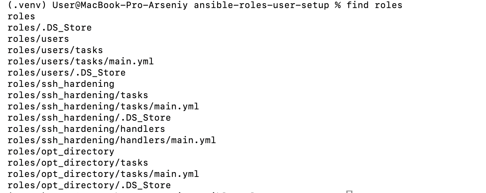
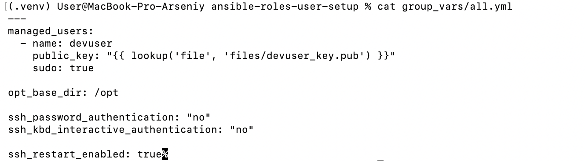
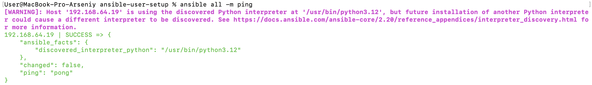
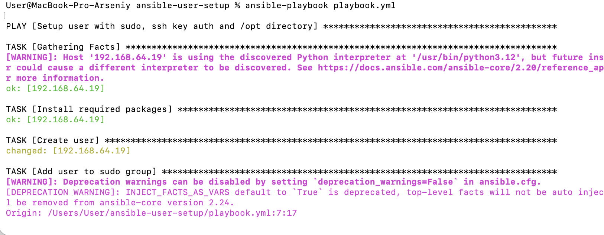
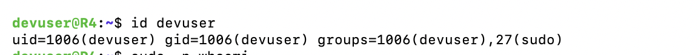
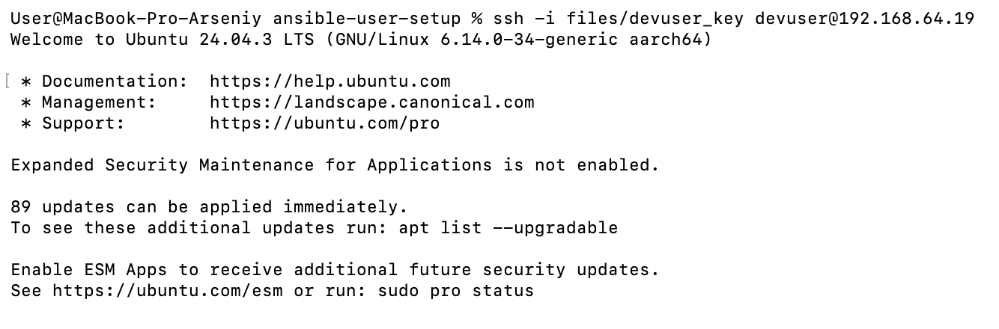
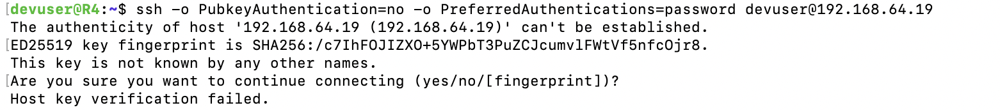
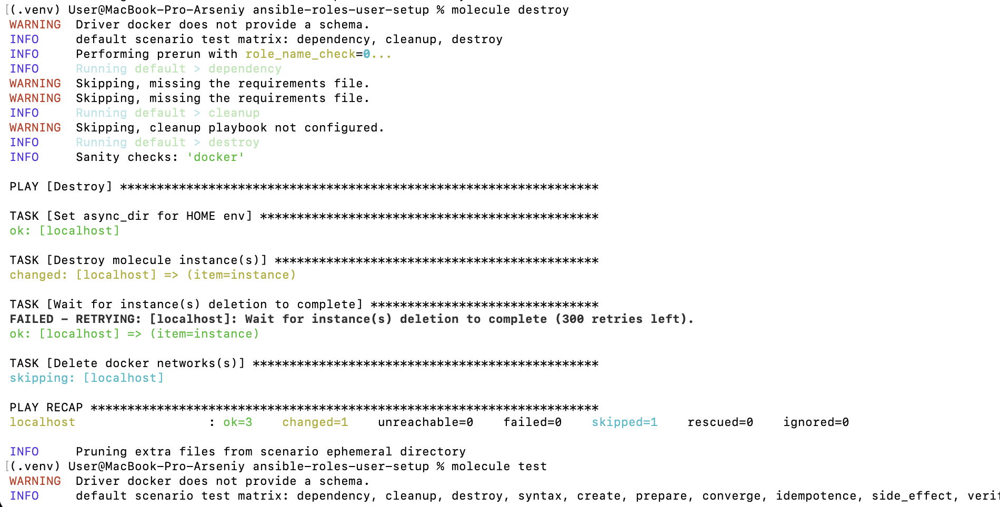
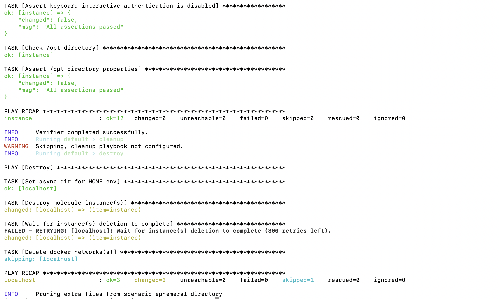

# №3 Ansible Roles

В лабораторной работе был реализован Ansible playbook с разделением логики на роли и тестированием через Molecule.

---
1) project structure
```text
.
├── README.md
├── ansible.cfg
├── inventory.ini
├── playbook.yml
├── .gitignore
├── collections
│   └── requirements.yml
├── files
│   └── devuser_key.pub
├── group_vars
│   └── all.yml
├── roles
│   ├── users
│   │   └── tasks
│   │       └── main.yml
│   ├── ssh_hardening
│   │   ├── tasks
│   │   │   └── main.yml
│   │   └── handlers
│   │       └── main.yml
│   └── opt_directory
│       └── tasks
│           └── main.yml
├── molecule
│   └── default
│       ├── molecule.yml
│       ├── converge.yml
│       └── verify.yml
└── screenshots
    ├── 02_roles_structure.png
    ├── 03_vars_users.png
    ├── 04_ansible_ping.png
    ├── 05_playbook_run.png
    ├── 06_user_check.png
    ├── 07_ssh_key_auth.png
    ├── 08_password_auth_disabled.png
    ├── 09_opt_directory.png
    └── 10_molecule_test.png
```
---

## Скриншоты выполнения




На скриншоте показано разделение Ansible-логики на роли `users`, `ssh_hardening` и `opt_directory`.

---



На скриншоте показан файл `group_vars/all.yml`, где задаются пользователь, SSH-ключ и параметры настройки.

---



На скриншоте показана успешная проверка подключения к удаленной машине через `ansible all -m ping`.

---



На скриншоте показан запуск `ansible-playbook playbook.yml` и применение ролей.

---



На скриншоте показано, что пользователь `devuser` был успешно создан.

---



На скриншоте показано успешное подключение по SSH-ключу без ввода пароля.

---



На скриншоте показано, что SSH-авторизация по паролю отключена.

---


На скриншоте показано, что директория `/opt/devuser_workdir` создана с нужным владельцем и правами.

---




На скриншоте показан запуск полного тестирования ролей через `molecule test`.

---


## Итог

Playbook успешно создает пользователя, настраивает SSH-доступ, создает директорию в `/opt/` и проходит тестирование через Molecule.