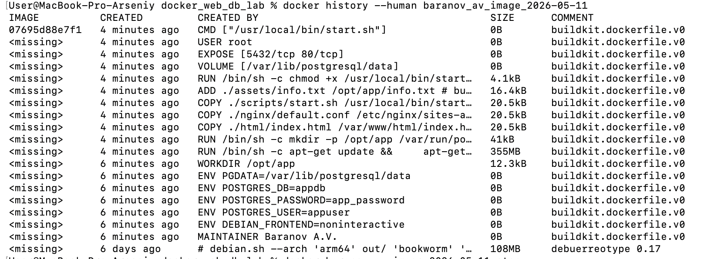

# lab4 - Dockerfile
## Как работает контейнер

При запуске контейнера стартуют два процесса:

- Nginx — принимает HTTP-запросы;
- PostgreSQL — хранит данные.

Nginx доступен на порту `80` внутри контейнера и пробрасывается на порт `8080` хостовой машины.

PostgreSQL работает на порту `5432` внутри контейнера и пробрасывается на порт `5433`.

В Dockerfile используются инструкции:

## Dockerfile
- FROM
- MAINTAINER
- RUN
- CMD
- WORKDIR
- ENV
- ADD
- COPY
- VOLUME
- USER
- EXPOSE

## Сборка image

```bash
docker build -t baranov_av_image_2026-05-11 .
```

## Запуск контейнера

```bash
docker run -d --name baranov_av_container -p 8080:80 -p 5433:5432 baranov_av_image_2026-05-11
```

## Проверка Nginx

```bash
curl http://localhost:8080
```

Или открыть в браузере:

```text
http://localhost:8080
```

Проверка health endpoint:

```bash
curl http://localhost:8080/health
```

## Проверка PostgreSQL внутри контейнера

```bash
docker exec -it baranov_av_container bash -lc 'PGPASSWORD=app_password psql -h 127.0.0.1 -U appuser -d appdb -c "SELECT version();"'
```

## Слои image и их размера



## Остановка и удаление контейнера

```bash
docker stop baranov_av_container
docker rm baranov_av_container
```
